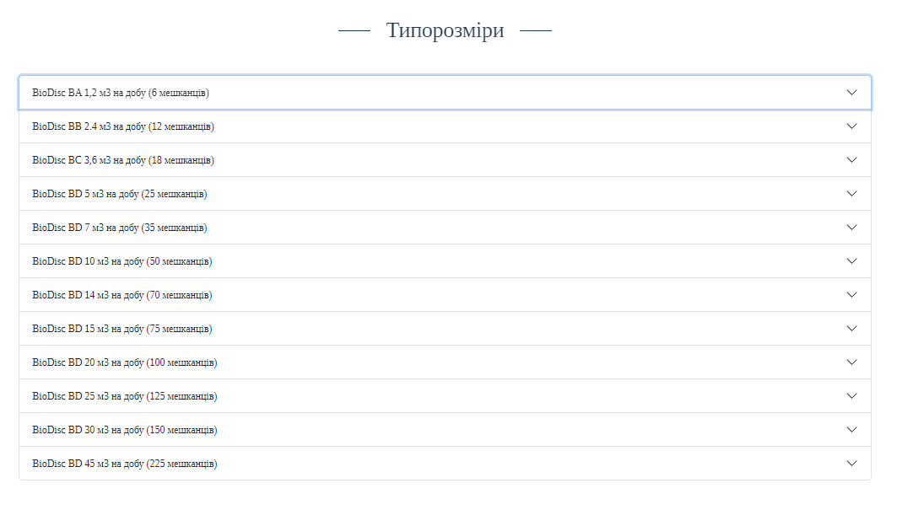

# kingspan ziko (real order)

[Here you can check it](https://artemuholkov.github.io/kingspan-ziko/)

---

I didn't have figma design for this project.
This landing page is 100% responsive for all types of screens.
I used HTML, CSS, JS in this project.

---

### What was interesting in this project:

1. Main section has video as background


2. Flexbox section


3. Sizes list(boostrap dropdown).




4. Double Slider. Connected using CDN.


```
 <script>
      var swiper = new Swiper('.mySwiper', {
        navigation: {
          nextEl: '.swiper-button-next',
          prevEl: '.swiper-button-prev',
        },
        loop: true,
        autoplay: {
          delay: 3000,
        },
      });
    </script>
```

4. Contacts with google map.


---
